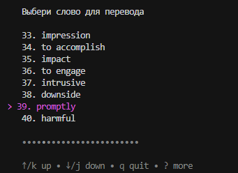
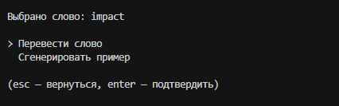
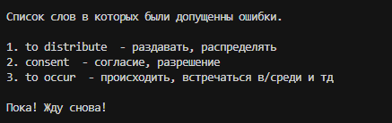

# Eng-Util

Утилита для повтора английских слов с приоритетом по выбору. 

В основе повтора доступны две опции: 
1. Ввод перевода для слова.
2. Генерация предложения со словом для дальнейшего перевода.





### Требования
1. Иметь файл с английскими словами + переводом. Формат ->
```shell
to retrieve -
	получать, извлекать, вернуть себе
tedious - 
	утомительный, скучный
to substitute -
	заменять, подставлять
```

2. После английского слова обязательно должен быть знак '-', иначе сканер прервется раньше времени.
3. Если слов перевода несколько, то они должны быть перечислены через запятую.
___

### Запуск
1. Настройка переменных окружения
```shell
make copy
```

2. Пинг LLM (поддерживается ollama, советую gemma3:1b, она быстрая и идеально справляется с задачами.)
```shell
make ping-llm
```

3. Сборка проекта в бинарник
```shell
make build
```